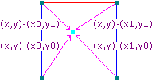

## Perlin Noise Generation 

<hr>

- Important thing to note here is that, if a noise function `PerlinNoise`  exists for 3 dimensions such that

  ```python
  PerlinNoise(x, y, z)
  ```

  then, 

  ```python
  # the noise val for point x=3, y=0, z=0 in 3-d
  noise_val = PerlinNoise(3, 0, 0)
  # the noise val for point x=3 in 1-d
  noise_val2 = PerlinNoise(3)
  
  print(noise_val == noise_val2)
  ```

  the output of the above snippet will be `true`.

### Generation Logic

<hr>
Perlin Noise (for 3-D, 2-D and 1-D) can be generated using vector operations effectively.


Firstly to find the Perlin Noise value for a co-ordinate in space, we locate the co-ordinate inside of a unit cell (square in 2-D and cube in 3-D).

>For eg.
>
>if the co-ordinates are (x, y, z) we calculate its location inside a unit cell by (x, y, z) % 1.0


Above image shows the point inside of the unit square.

Each unit square co-ordinate, we generate what is called a pseudorandom gradient vector. By pseudorandom, it means that for any set of integers inputted in the gradient vector equation, the same gradient vector will be generated, i.e. its not entirely random. So, every integral co-ordinate has its own gradient vector which doesnot change if the gradient vector function doesnot change.


Example gradient vectors.

>Note
>
>In Ken Perlin's Improved algorithm, the gradient vectors are not completely random. Instead, they are chosen from vectors, that point from the unit cell co-ordinate to the center of the unit cell.
>
>i.e. A random vector is chosen from 
>
>{
>
>​	(1, 1), (-1, 1)
>
>​	(1, -1), (-1, -1)
>
>}
>
>In this implementation, will be doing the same.

Next, we calculate the distance vectors from the unit cell point to our input point as shown below.



We, then need to compute the dot product between the distance vector and the gradient vector to get values at the four corners and linearly interpolating between them using the "faded" co-ordinate values of our input point, thus getting an average value for our input point.

```python
# Eg. in 2-D
# Below are the 4 values from the dot product
# d1 | d2
# --------
# d3 | d4

# u and v are the "faded" co-ordinates of our point in the unit square
# (xf, yf) = location of our point inside the unit square
u, v = fade(xf), fade(yf)

x1 = lerp(d1, d2, u)
x2 = lerp(d3, d4, u)

avg = lerp(x1, x2, v)
```

Logically, thats all we want.

### Generation using Octaves

<hr>

Simple Perlin Noise provides a certain degree of natural behaviour, but it still looks very smooth and unrealistic. For eg, real world terrains or mountains have detailed features like hills, boulders, rocks etc..

But Perlin Noise does not provide these details. A simple solution is: We take multiple `noise` functions having different frequencies and different amplitudes, and add them together.

`Frequency` represents the period at which the sample points occur in the noise space and `Amplitude` represents the range at which the noise value can be.


The above figure show the sum of various noise values.

These are called different <i>octaves</i> of noise. Each successive octave contributes less and less to the final noise value. Also, the code execution time increases with increase in number of octaves. So its better to have few octaves for some amount of detail to the <i>noise</i>.

And now, we are finally done.