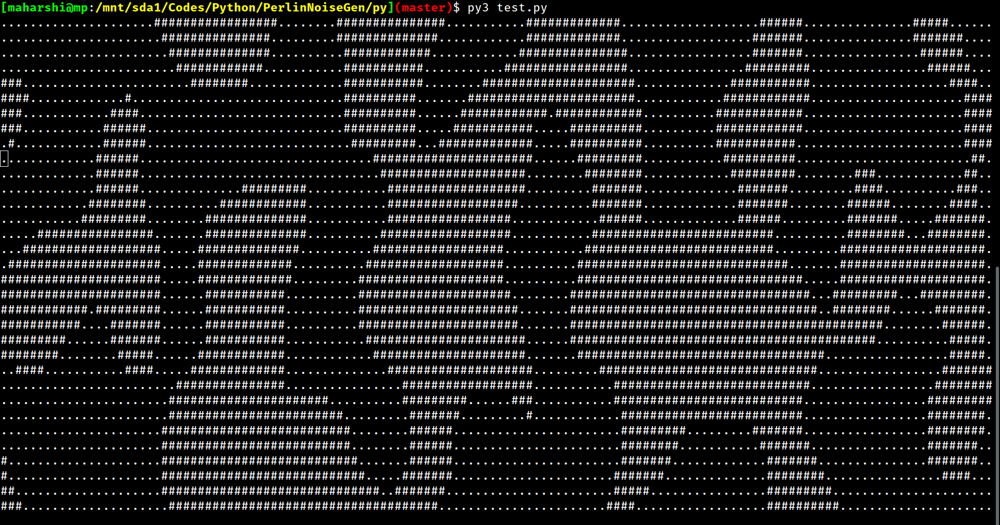
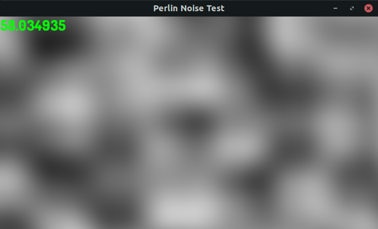

## Perlin Noise Implementation

Improved Perlin Noise Generation algorithm as designed by Ken Perlin is implemented here.

> Perlin Noise function can be defined for any number of dimensions.
>
> However, in this implementation, the max dimension in which the noise value can be generated is 3-dimensions.

To go through the algorithm to generate noise values for any given input co-ordinate, refer the `ALGODETAILS.md` file.

### Results

<hr>

The `cpp-test/` directory contains the code to test the Perlin Noise algorithm. It uses [SFML](https://www.sfml-dev.org/) library to generate a "Noise Map" where the color of individual pixels is determined by the `noise` function which is implemented in C.

Here's the result:


#### Python 



>The Python visualisation is in the terminal itself.
>
>It dynamically renders the characters based on the noise value at that point in the terminal.
>
>Now thats good!


<hr>

#### C++



It is evident from the above generated "Noise Maps" that Perlin Noise generates "smooth" random values.

- To run the above cpp-test, make sure that `SFML` is installed locally on your machine

```shell
$ cd cpp-test
$ make all
```

With this, the `PerlinNoise` binary will be generated in `bin/`

```shell
$ cd bin/
$ ./PerlinNoise
```

- To run the Terminal visualisation in C++

```shell
$ cd cpp-test/
$ g++ pn_test_terminal.cpp -o PerlinTerm
$ ./PerlinTerm
```


#### Various Sources

<hr>

- [Perlin Noise Wiki](https://en.wikipedia.org/wiki/Perlin_noise)

- [Understanding Perlin Noise](https://adrianb.io/2014/08/09/perlinnoise.html)
- [What is it?](https://blog.hirnschall.net/perlin-noise/)
- [Implementation in various languages](https://rosettacode.org/wiki/Perlin_noise)
